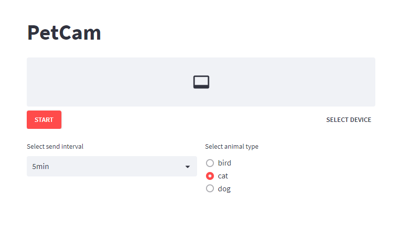

# line_petcam_app
This is an application that sends a photo of your pet by Line Notify.  
You can check on your pet with your smartphone anywhere, even when you are not at home.

# How to use
## 1. Clone this package
> git clone https://github.com/tosiyuki/line_petcam_app.git

## 2. Install requirement library
> pip install -r requirements.txt

## 3. Create Line Notify token
This software need to create line notify token. Please create below link.  
https://notify-bot.line.me/  

You finish creating token, please copy token to "src/config/setting.json".

## 4. Run the script
> cd src
> streamlit run pet_cam_app

You start script, connect localhost::8501 and push start button.

# License
The source code is licensed Apache License 2.0.